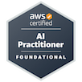

# Olá, eu sou Guilherme Santos Souza 👋

## Cloud Computing | DevOps | Infraestrutura ☁️

Formado em Análise e Desenvolvimento de Sistemas e atualmente cursando MBA em Cloud Computing.

Tenho foco em computação em nuvem, automação, containers, infraestrutura como código e práticas DevOps. Atualmente estudo AWS e Microsoft Azure com foco em arquitetura, operações, segurança e automação de ambientes cloud.

## 📫 Contato

## 🏅 Certificações

  

  

  

### Certificações conquistadas

- Microsoft Certified: Azure Fundamentals (AZ-900)
- Microsoft Certified: Azure AI Fundamentals (AI-900)
- AWS Certified AI Practitioner

## 🛠️ Tecnologias

  

## 💼 Áreas de Interesse

- Cloud Engineering
- DevOps
- Platform Engineering
- Infrastructure Engineering
- Cloud Security
- Site Reliability Engineering (SRE)

